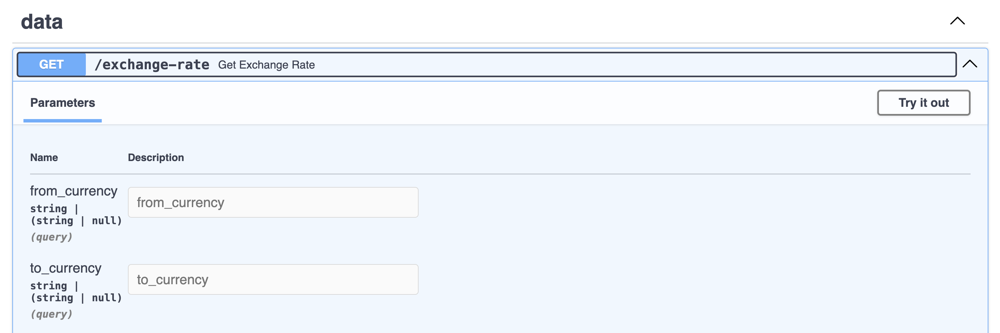
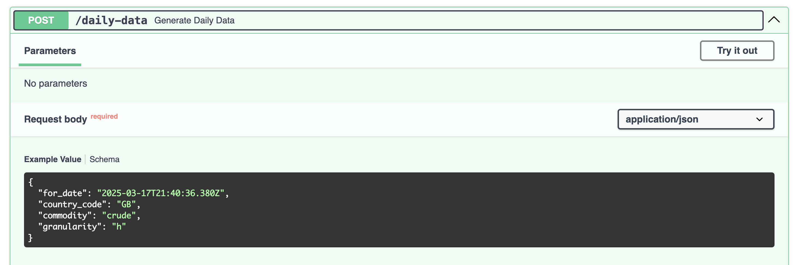

## API

The API includes 2 endpoints, one for obtaining the current valid exchange rate between
two currencies and another one to generate the data that simulates the price for a given
date, commodity and country.

### Endpoints

`GET /exchange-rate`

`POST /daily-price`

